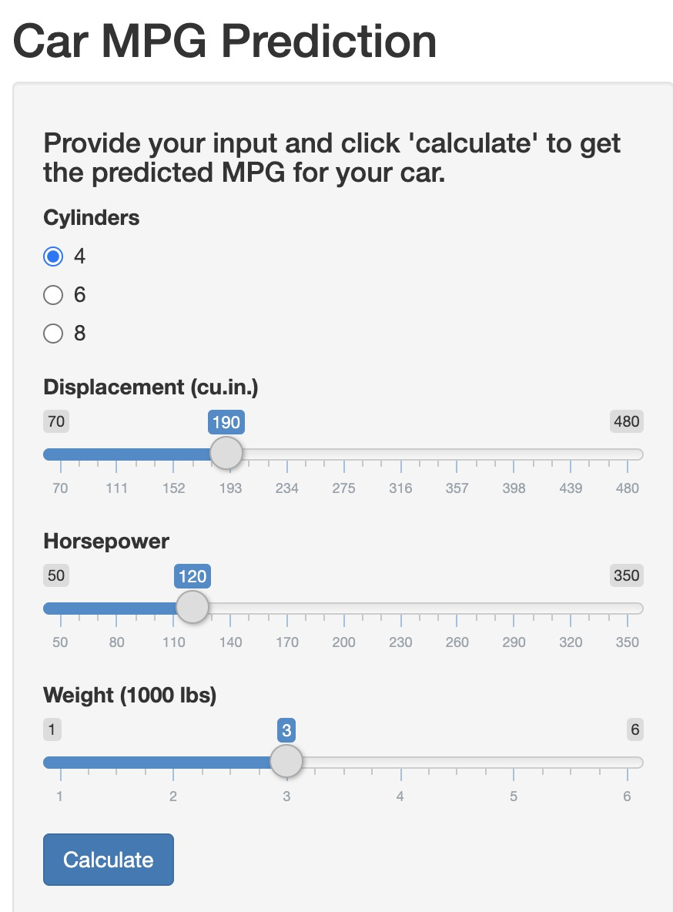
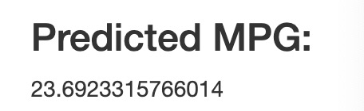

## Introduction

This project is for the Week 3 Assignment of Developing Data Product course of the Coursera Data Science Specialization. 

The goal of this project is to create a Shiny application, deploy it on Rstudio's servers, and use RStudio Presenter to prepare a reproducible pitch presentation about the Shiny application.

In this project, I will use the motor trend car road tests dataset to develop a model to predict a new car's MPG. The Shiny application will predict a new car's miles per gallon (MPG) based on user's input about the car's characteristics.

## Data

The dataset `mtcars` is used in this project. The dataset has 32 observations and 11 variables.

```{r, comment = ''}
str(mtcars)
```

## Model
I use four predictors and the GLM model to predict these cars' MPG. The predicted MPGs and the true MPGs align well on the 45 degree, indicating decent fit of the GLM model. 

```{r message=FALSE}
library(caret)
mod <- train(mpg ~ cyl + disp + hp + wt, method = "glm", data = mtcars)
```


```{r echo = FALSE, fig.width = 3, fig.height = 3, fig.align = 'center'}
mpg_pred <- predict(mod, mtcars)
ggplot(data.frame(truth = mtcars$mpg, pred = mpg_pred), 
               aes(x = pred, y = truth)) + 
            geom_point() + 
            geom_abline(intercept = 0, slope = 1, linetype = 'dashed') + 
            labs(x = "Predicted MPG", y = "True MPG", 
                 title = 'GLM Model Fit Performance') + 
            coord_fixed() + 
            xlim(c(0, 35)) + 
            ylim(c(0, 35)) + 
            theme_bw() + 
            theme(plot.title = element_text(hjust = 0.5))
```

## Shiny App

<div style="float: left; width: 40%;">
{height=400px}
{width=300px}
</div>

<div style="float: right; width: 60%;">
* Users can provide their car characteristics (number of cylinders, displacement, horsepower and weight)

<br>

* The application will make prediction of the car MPG. 

<br>

* Source code is available [here](https://github.com/caojie528/Developing_Data_Products_Project)

</div>


